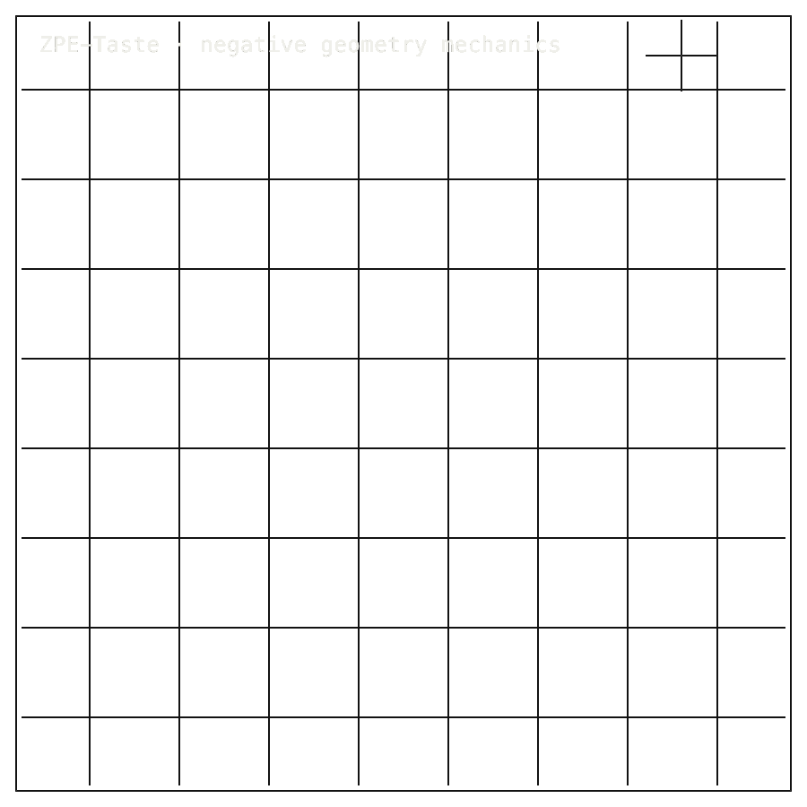

# ZPE-Taste

## Package Install

Installable package: `python3.11 -m pip install zpe-taste`.
Current release: `0.1.0` on [PyPI](https://pypi.org/project/zpe-taste/).
Source: [Zer0pa/ZPE-Taste](https://github.com/Zer0pa/ZPE-Taste/).

```bash
python3.11 -m pip install zpe-taste
```

For full install, smoke, source, and developer commands, [click here](#install-developer-commands-detailed).

---

<table width="100%">
<tr>
<td width="100%" valign="top">
<div><span><b>00 · ZPE-TASTE</b> · EVIDENCED NEGATIVE</span> <span>RESEARCH-READY · NEGATIVE RESULT</span></div>
      <h1>Failing at the <span>geometry of taste.</span></h1>
      <p>Published null result on a taste-encoding object · ZPE-Taste · PyPI <em>zpe-taste</em> 0.1.0 · github.com/Zer0pa/ZPE-Taste</p>
      <p>A taste object was tested as a geometry-bearing signal. It failed. <em>metric_fit</em> scored <strong>0.207</strong> against a <strong>0.6</strong> threshold, and the three remaining geometry gates also missed. Identity controls returned <strong>1.000</strong>, so the evaluator was working. The committed record holds four numbers, four thresholds, and the read-only commands that reproduce them. The geometry of taste has not been found; the next attempt no longer starts from zero.</p>
</td>
</tr>
</table>

<table width="100%">
<tr>
<td width="100%" valign="top">
<figure>
        <div></div>
        <figcaption><b>Result:</b> evidenced negative. Four geometry metrics missed threshold; identity controls passed, so the floor is published.</figcaption>
      </figure>
</td>
</tr>
</table>

<table width="100%">
<tr>
<td width="100%" valign="top">
<div><b>01 · THE GAP</b> <span>NO PUBLISHED FLOOR</span></div>
      <h2>Taste geometry needs public negative results, not private dead ends.</h2>
</td>
</tr>
</table>

<table width="100%">
<tr>
<td width="100%" valign="top">
<div><b>02 · MARKETS</b> <span>RESEARCH CONTEXT</span></div>
      <div>
        <div>
          <div><span>Neurotechnology research</span>  <span>'24 · $0.75B/yr</span></div>
          <div><span>DARPA basic research</span>  <span>'24 · $0.44B/yr</span></div>
          <div><span>Neuroscience research software</span>  <span>'30 · $1.2B</span></div>
          <div><span>Open-science / replication infrastructure</span>  <span>'28 · est. $0.3B</span></div>
          <div><span>Academic neuro-AI tooling</span>  <span>'30 · est. $0.6B</span></div>
        </div>
      </div>
      <div>Sensory-encoding research and replication infrastructure &mdash; the budgets that fund taste work and the desks that read negative results.</div>
</td>
</tr>
</table>

<table width="100%">
<tr>
<td width="50%" valign="top">
<div><b>03 · VALUE OF MARKET</b></div>
      <div>$0.75<span>B/yr</span></div>
      <div>NIH BRAIN Initiative funds taste research; what they cannot fund is a vague private failure.</div>
</td>
<td width="50%" valign="top">
<div><b>04 · INSIGHT</b></div>
      <h2>Taste was measured. The geometry wasn't there. <span>The record is.</span></h2>
</td>
</tr>
</table>

<table width="100%">
<tr>
<td width="50%" valign="top">
<div><b>05.1 · CURRENT TECH</b> <span>PRIVATE NEGATIVE RESULTS</span></div>
        <p>When a lab's taste-encoding model misses threshold, the numbers usually disappear into a private folder or a soft appendix. The next team rediscovers the same wall, with no way to know they have.</p>
</td>
<td width="50%" valign="top">
<div><b>05.2 · OUR TECH</b> <span>THE FLOOR PUBLISHED</span></div>
        <p><em>ZPE-Taste</em> commits the first openly-evaluated taste-geometry object as a record: <strong>0.207</strong> metric_fit, <strong>0.156</strong> topology_fit, <strong>0.250</strong> local injectivity, <strong>0.181</strong> graph_fit, all below their declared thresholds, with identity controls at <strong>1.000</strong> so the evaluator's verdict cannot be brushed off. Future taste-encoding work inherits a floor it has to clear.</p>
</td>
</tr>
</table>

<table width="100%">
<tr>
<td width="100%" valign="top">
<div><b>05.3 · BENCHMARKS</b> <span>GEOMETRY EVALUATION</span></div>
      <div>
        <div>
          <div><span>metric_fit</span><b>0.207</b><small>LOW</small></div>
          <div><span>topology_fit</span><b>0.156</b><small>LOW</small></div>
          <div><span>injectivity</span><b>0.250</b><small>LOW</small></div>
          <div><span>graph_fit</span><b>0.181</b><small>LOW</small></div>
        </div>
        <div>
          <div><span>metric_fit low</span>  <span>0.207</span></div>
          <div><span>topology_fit low</span>  <span>0.156</span></div>
          <div><span>controls PASS</span>  <span>1.000</span></div>
        </div>
      </div>
      <div><b>Result:</b> Four geometry metrics below threshold; identity controls at 1.000 &mdash; the evaluator was right to fail it.</div>
</td>
</tr>
</table>

<table width="100%">
<tr>
<td width="34%" valign="top">
<div><b>06 · MEASUREMENT</b> <span>GEOMETRY RESULT LEDGER</span></div>
      <h2>Four geometry metrics measured. Four <span>missed the threshold.</span></h2>
</td>
<td width="66%" valign="top">
<div><b>06.1 · COMPARATIVE PERFORMANCE · GEOMETRY RESULT STATUS</b></div>
      <div>
        <div>
          <div><span>metric_fit</span>  <span>0.207 LOW</span></div>
          <div><span>topology_fit</span>  <span>0.156 LOW</span></div>
          <div><span>injectivity</span>  <span>0.250 LOW</span></div>
          <div><span>graph_fit</span>  <span>0.181 LOW</span></div>
        </div>
      </div>
      <div>From <em>proofs/artifacts/taste_negative_reference.json</em>: <strong>metric_fit 0.207</strong> (gate 0.6), <strong>topology_fit 0.156</strong> (gate 0.5), <strong>local_injectivity 0.250</strong> (gate 0.5), <strong>graph_fit 0.181</strong> (gate 0.5). Identity controls <strong>1.000</strong> across all four. Read-only checks: <strong>4/4 PASS</strong>.</div>
</td>
</tr>
</table>

<table width="100%">
<tr>
<td width="100%" valign="top">
<div><b>07 · KEY METRICS</b> <span>ZPE-TASTE NEGATIVE REFERENCE</span></div>
</td>
</tr>
</table>

<table width="100%">
<tr>
<td width="100%" valign="top">
<div><b>07.1 · METRIC FIT</b></div>
      <div>0.207</div>
      <div>Below 0.6 gate &middot; <b>metric_fit</b></div>
</td>
</tr>
</table>

<table width="100%">
<tr>
<td width="100%" valign="top">
<div><b>07.2 · TOPOLOGY FIT</b></div>
      <div>0.156</div>
      <div>Below 0.5 gate &middot; <b>topology_fit</b></div>
</td>
</tr>
</table>

<table width="100%">
<tr>
<td width="100%" valign="top">
<div><b>07.3 · LOCAL INJECTIVITY</b></div>
      <div>0.250</div>
      <div>Below 0.5 gate &middot; <b>local_injectivity</b></div>
</td>
</tr>
</table>

<table width="100%">
<tr>
<td width="100%" valign="top">
<div><b>07.4 · GRAPH FIT</b></div>
      <div>0.181</div>
      <div>Below 0.5 gate &middot; <b>graph_fit</b></div>
</td>
</tr>
</table>

<table width="100%">
<tr>
<td width="100%" valign="top">
<div><b>07.5 · RELEASE</b></div>
      <div>0.1.0</div>
      <div>PyPI <em>zpe-taste</em> &middot; <b>0.1.1 pending</b></div>
</td>
</tr>
</table>

<table width="100%">
<tr>
<td width="100%" valign="top">
<div><b>08 · REPRODUCIBILITY</b> <span>NEGATIVE RESULT</span></div>
      <h2>The negative result reproduces. The record is <span>usable.</span></h2>
</td>
</tr>
</table>

<table width="100%">
<tr>
<td width="66%" valign="top">
<div><b>08.1 · WHAT REPLAYS EXACTLY</b> <span>FROZEN NEGATIVE PACKET</span></div>
      <p>Determinism here means the negative packet is frozen: scores, thresholds, identity controls, and the read-only commands that confirm them. Clone the repo on any Python 3.8+ host and the same four below-threshold numbers come back, with the same evaluator behaviour.</p>
      <p>What replays is not a taste reconstruction &mdash; it is the evidence that this geometry was tested, missed by these margins, and not silently retried. The next team can argue with the object or the metrics, but not with whether the experiment happened.</p>
</td>
<td width="34%" valign="top">
<div><b>08.2 · HONEST BLOCKER</b></div>
      <span>Honest Blocker &middot;</span>
      <p><strong>No positive taste codec exists.</strong> All four geometry metrics sit below threshold. Replay parity does not outrank a working decoder. The strongest evaluator control depends on full-packet identity. No external comparators have been published in this domain. PyPI <em>zpe-taste 0.1.0</em> is stale; <em>0.1.1</em> is pending.</p>
</td>
</tr>
</table>

<table width="100%">
<tr>
<td width="33%" valign="top">
<div><b>09</b> </div>
      <h2>WHAT A PUBLISHED <span>NULL UNLOCKS.</span></h2>
</td>
<td width="67%" valign="top">
<div><b>09.1 · THIS LAB'S AMBITION</b></div>
      <p>The aim is not a taste encoder. It is a piece of scientific infrastructure: the first openly-evaluated taste-geometry object, committed as a negative with four scored metrics, declared thresholds, and identity controls. A taste-research field that argues over receptor-space versus psychophysical-space now has a number to argue against.</p>
</td>
</tr>
</table>

<table width="100%">
<tr>
<td width="33%" valign="top">
<div><b>09.2 · WHAT THIS IS</b></div>
        <h2>A taste-geometry attempt scored, missed every gate, <span>and shipped the numbers anyone can rerun.</span></h2>
</td>
<td width="67%" valign="top">
<div><b>09.3 · WHAT'S STILL OPEN</b></div>
        <h2>Which taste object &mdash; receptor-space, psychophysical-space, or something unnamed &mdash; is the one to encode next.</h2>
</td>
</tr>
</table>

<table width="100%">
<tr>
<td width="100%" valign="top">
<div><b>09.4</b> &middot; REPLICATION · NEAR-TERM (12–24 MO)</div>
      <div>Other labs start from a real floor</div><div>A second taste-encoding team can clone the record, run the same four metrics on their own candidate object, and report a number that means the same thing. The conversation about taste-geometry stops being anecdotal and starts being comparable.</div>
</td>
</tr>
</table>

<table width="100%">
<tr>
<td width="100%" valign="top">
<div><b>09.5</b> &middot; PROCUREMENT · NEAR-TERM (12–24 MO)</div>
      <div>Program officers see what taste does not do</div><div>DARPA, ARO, and academic funders evaluating sensory-encoding proposals get a citable boundary they can hand to applicants: this is what failed, this is where the threshold sits, propose against it. Calibration replaces narrative.</div>
</td>
</tr>
</table>

<table width="100%">
<tr>
<td width="100%" valign="top">
<div><b>09.6</b> &middot; RETHINK · MID-TERM (24–48 MO)</div>
      <div>The next taste model must clear a number</div><div>A research lead deciding between a receptor-space and a psychophysical-space encoder no longer chooses on intuition. Either approach has to beat 0.207 metric_fit and the three other gates, in public, before claiming the geometry of taste was found.</div>
</td>
</tr>
</table>

<table width="100%">
<tr>
<td width="100%" valign="top">
<div><b>09.7</b> &middot; SENSOR INDUSTRY · MID-TERM (24–48 MO)</div>
      <div>E-tongue and taste-masking buyers ask harder questions</div><div>Beverage formulation chemists and pharma taste-masking analysts evaluating electronic-tongue platforms get a public-domain reference for what a published taste-geometry claim should look like. Vendor demos start needing the same four metrics, scored.</div>
</td>
</tr>
</table>

<table width="100%">
<tr>
<td width="100%" valign="top">
<div><b>09.8</b> &middot; OPEN SCIENCE · PARADIGM (48 MO+)</div>
      <div>Sensory claims arrive with falsifiable scores</div><div>A field where any sensory-encoding paper &mdash; taste, smell, touch, interoception &mdash; is expected to ship measured geometry scores, declared thresholds, and identity controls. The cost of an unverified sensory claim rises; the value of a published null finally matches the value of a published positive.</div>
</td>
</tr>
</table>

---

<a id="install-developer-commands-detailed"></a>

## Install / Developer Commands Detailed

<!-- INSTALL-DX:START -->
#### Package Install

Installable package: `python3.11 -m pip install zpe-taste`.
Current release: `0.1.0` on [PyPI](https://pypi.org/project/zpe-taste/).
Source: [Zer0pa/ZPE-Taste](https://github.com/Zer0pa/ZPE-Taste/).

```bash
python3.11 -m pip install zpe-taste
```

Import smoke:

```bash
python3.11 - <<'PY'
import importlib.metadata as md
import zpe_taste

print("zpe-taste", md.version("zpe-taste"))
PY
```


CLI smoke:

```bash
zpe-taste-verify --help
```

Install success only proves package acquisition/import. Product scope, stale PyPI state, platform limits, and blockers remain in the front-door sections below.
- PyPI copy is stale; install success does not change the evidenced-negative result.
<!-- INSTALL-DX:END -->

#### Quick Start

```bash
python3 -m venv .venv
. .venv/bin/activate
python -m pip install --upgrade pip
pip install .
python -m zpe_taste.verify
python -m unittest discover -s tests -v
```
